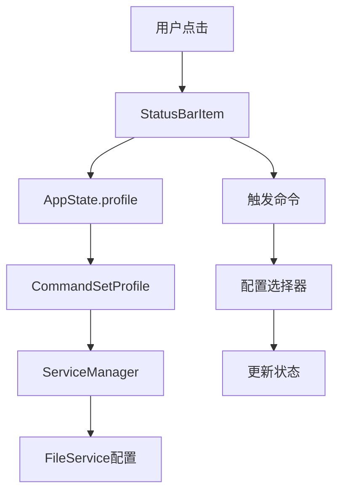
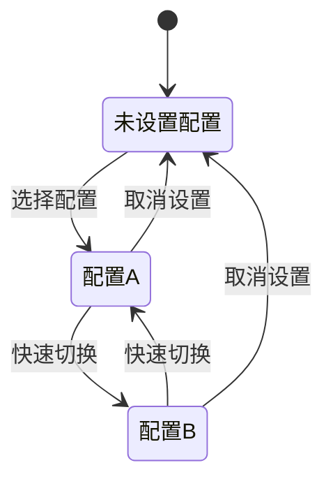
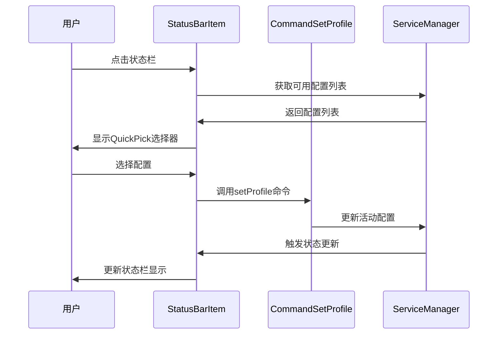
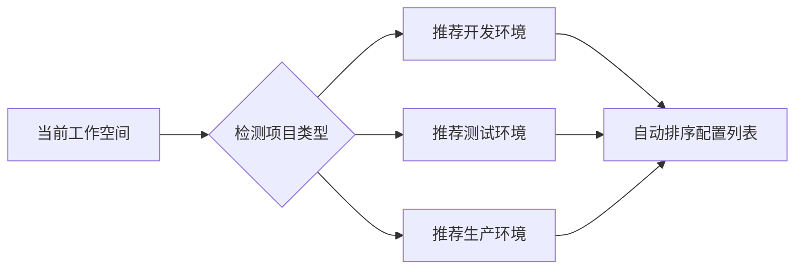
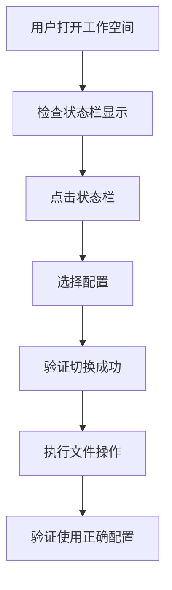

# SFTP配置快速切换功能设计

## 1. 概述

### 功能需求
在VS Code编辑器底部状态栏添加一个快速切换SFTP配置的功能，允许用户通过点击状态栏项目快速在不同的SFTP配置文件（profiles）之间切换，而无需使用命令面板。

### 价值主张
- **提升用户体验**：单击即可切换配置，减少操作步骤
- **提高开发效率**：快速在开发/测试/生产环境间切换
- **降低学习成本**：可视化的配置显示，无需记忆命令

### 目标用户
- 需要在多个远程环境间频繁切换的开发者
- 管理多个SFTP服务器配置的用户
- 希望简化配置切换操作的用户

## 2. 技术架构

### 现有架构分析
项目已具备实现该功能的基础设施：



### 核心组件交互

| 组件 | 职责 | 现有实现 |
|------|------|----------|
| StatusBarItem | 状态栏显示和交互 | ✅ 已实现基础功能 |
| AppState | 全局配置状态管理 | ✅ 支持profile切换 |
| CommandSetProfile | 配置切换逻辑 | ✅ 支持参数化调用 |
| ServiceManager | 配置服务管理 | ✅ 多配置支持 |

### 功能增强点

#### 2.1 StatusBarItem增强
```typescript
interface StatusBarEnhancement {
  // 新增下拉菜单支持
  showProfileSelector(): void;
  
  // 配置列表显示
  renderProfileList(profiles: ProfileItem[]): void;
  
  // 快速访问最近使用的配置
  getRecentProfiles(): string[];
}
```

#### 2.2 配置状态管理


## 3. 用户界面设计

### 3.1 状态栏显示模式

| 状态 | 显示内容 | 图标 | 行为 |
|------|----------|------|------|
| 无配置 | `SFTP` | 🔗 | 点击显示配置列表 |
| 已选择配置 | `SFTP: dev` | 🔗 | 点击显示切换菜单 |
| 传输中 | `⠋ SFTP: dev` | 动画 | 点击显示输出面板 |
| 错误状态 | `⚠ SFTP: dev` | ⚠ | 点击显示错误信息 |

### 3.2 交互流程设计



### 3.3 配置选择器界面

```
┌─ Select SFTP Profile ──────────────────┐
│ ● dev (active)                         │
│   test                                 │
│   production                           │
│   ──────────────────────────────────   │
│   UNSET                                │
│   ──────────────────────────────────   │
│   $(gear) Edit Configurations...      │
└────────────────────────────────────────┘
```

## 4. 实现方案

### 4.1 状态栏组件增强

#### 增强现有StatusBarItem类
```typescript
// 位置: src/ui/statusBarItem.ts
class StatusBarItem {
  // 新增方法：处理配置切换
  async handleProfileSwitch() {
    const profiles = this.getAvailableProfiles();
    const selectedProfile = await this.showProfileQuickPick(profiles);
    if (selectedProfile !== undefined) {
      await this.setActiveProfile(selectedProfile);
    }
  }
  
  // 获取可用配置列表
  private getAvailableProfiles(): ProfileItem[] {
    return getAllFileService().reduce((acc, service) => {
      return acc.concat(
        service.getAvailableProfiles().map(profile => ({
          label: app.state.profile === profile ? `${profile} (active)` : profile,
          value: profile,
          description: service.name || service.baseDir
        }))
      );
    }, [{ label: 'UNSET', value: null }]);
  }
}
```

### 4.2 命令增强
```typescript
// 位置: src/commands/commandSetProfile.ts
export default checkCommand({
  id: COMMAND_SET_PROFILE,
  
  async handleCommand(definedProfile) {
    // 支持从状态栏直接调用
    if (definedProfile === 'quick-select') {
      return this.showQuickSelector();
    }
    
    // 原有逻辑保持不变
    // ...existing code...
  },
  
  async showQuickSelector() {
    const profiles = this.buildProfileList();
    const item = await vscode.window.showQuickPick(profiles, {
      placeHolder: 'Select SFTP Profile',
      ignoreFocusOut: true
    });
    
    if (item) {
      app.state.profile = item.value;
    }
  }
});
```

### 4.3 应用初始化更新
```typescript
// 位置: src/app.ts
app.sftpBarItem = new StatusBarItem(
  () => {
    if (app.state.profile) {
      return `SFTP: ${app.state.profile}`;
    } else {
      return 'SFTP';
    }
  },
  'Click to switch SFTP profile', // 更新tooltip
  COMMAND_SET_PROFILE_QUICK // 新命令
);
```

## 5. 配置管理增强

### 5.1 配置元数据支持
```typescript
interface ProfileMetadata {
  name: string;           // 配置显示名称
  description?: string;   // 配置描述
  environment?: string;   // 环境标识 (dev/test/prod)
  lastUsed?: Date;       // 最后使用时间
  color?: string;        // 状态栏颜色标识
}
```

### 5.2 最近使用配置记录
```typescript
// 位置: src/modules/appState.ts
class AppState {
  private _recentProfiles: string[] = [];
  
  set profile(newProfile: string | null) {
    if (this._profile === newProfile) return;
    
    // 记录最近使用的配置
    if (newProfile && this._recentProfiles.includes(newProfile)) {
      this._recentProfiles = this._recentProfiles.filter(p => p !== newProfile);
    }
    if (newProfile) {
      this._recentProfiles.unshift(newProfile);
      this._recentProfiles = this._recentProfiles.slice(0, 5); // 保持最近5个
    }
    
    this._profile = newProfile;
    this._observer(this.getStateSnapshot());
  }
  
  getRecentProfiles(): string[] {
    return [...this._recentProfiles];
  }
}
```

## 6. 用户体验优化

### 6.1 视觉反馈设计

| 场景 | 状态栏显示 | 颜色 | 动画 |
|------|------------|------|------|
| 切换中 | `⟳ Switching...` | 蓝色 | 旋转 |
| 切换成功 | `✓ SFTP: dev` | 绿色 | 闪烁1秒 |
| 切换失败 | `✗ Switch failed` | 红色 | 显示2秒 |

### 6.2 快捷操作支持

#### 键盘快捷键
```json
{
  "key": "ctrl+shift+s",
  "command": "sftp.setProfile.quick",
  "when": "sftp.enabled"
}
```

#### 右键菜单集成
```typescript
// 在文件资源管理器右键菜单中添加
{
  "command": "sftp.setProfile.quick",
  "when": "resourceScheme == file && sftp.enabled",
  "group": "sftp@1"
}
```

### 6.3 智能推荐



## 7. 测试策略

### 7.1 单元测试覆盖

| 测试模块 | 测试场景 | 预期结果 |
|----------|----------|----------|
| StatusBarItem | 配置切换交互 | 正确显示选择器 |
| AppState | 配置状态管理 | 状态正确更新 |
| CommandSetProfile | 快速选择逻辑 | 配置正确切换 |

### 7.2 集成测试场景

```typescript
describe('SFTP配置快速切换', () => {
  test('从状态栏点击切换配置', async () => {
    // 1. 点击状态栏
    await clickStatusBarItem();
    
    // 2. 验证显示配置选择器
    expect(getQuickPickItems()).toContain(['dev', 'test', 'prod']);
    
    // 3. 选择配置
    await selectQuickPickItem('test');
    
    // 4. 验证配置已切换
    expect(getCurrentProfile()).toBe('test');
    expect(getStatusBarText()).toBe('SFTP: test');
  });
});
```

### 7.3 用户场景测试

