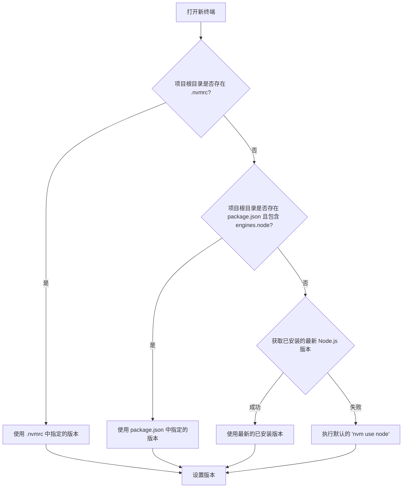

# VS Code NVM

在 VS Code 中无缝切换由 [nvm-windows](https://github.com/coreybutler/nvm-windows) 管理的 Node.js 版本。

## 概述 (Overview)

VS Code NVM 是一款旨在简化 Node.js 版本管理工作流的扩展。它将 `nvm-windows` 的核心功能直接集成到您的 VS Code 编辑器中，让您无需离开当前环境即可轻松切换版本。无论是处理有特定 Node.js 版本要求的旧项目，还是探索最新版本的新功能，此扩展都能为您提供极大的便利。

## 核心功能 (Features)

- **📊 状态栏实时显示**: 在 VS Code 左下角状态栏清晰地显示当前激活的 Node.js 版本，让您对环境一目了然。
- **⚡️ 快速版本切换**: 只需点击状态栏或执行一个简单的命令，即可在已安装的 Node.js 版本之间快速切换。
- **🤖 新终端自动切换**: 当您打开一个新的集成终端时，扩展会智能地根据项目配置（`.nvmrc` 或 `package.json`）自动设置对应的 Node.js 版本，实现项目级环境隔离。
- **🧠 智能版本检测**: 扩展会定期检查并同步当前环境的 Node.js 版本，确保状态栏显示的信息始终准确无误。

## 先决条件 (Prerequisites)

- **VS Code**: `1.74.0` 或更高版本。
- **nvm-windows**: 您必须在 Windows 系统上预先安装并配置好 [nvm-windows](https://github.com/coreybutler/nvm-windows)。

## 使用指南 (Usage)

### 手动切换版本

1.  **点击状态栏**: 直接点击 VS Code 左下角状态栏显示的 `Node: vX.X.X` 文本。
2.  **使用命令面板**: 按下 `Ctrl+Shift+P` 打开命令面板，输入并选择 `NVM: Switch Node.js Version`。
3.  从弹出的列表中选择一个您希望切换到的已安装版本。
4.  扩展将在活动的终端中执行 `nvm use` 命令，并更新状态栏显示。

### 自动版本切换逻辑

当您打开一个新的集成终端时，扩展会遵循以下优先级顺序来自动为您设置 Node.js 版本：



## 配置 (Configuration)

要为您的项目指定一个特定的 Node.js 版本，您可以在项目根目录下进行以下配置（二选一即可，`.nvmrc` 优先）：

-   **使用 `.nvmrc` 文件**:
    在项目根目录创建一个名为 `.nvmrc` 的文件，并在其中写入版本号。例如：
    ```
    18.17.1
    ```

-   **使用 `package.json`**:
    在您的 `package.json` 文件中，添加 `engines` 字段并指定 `node` 的版本。
    ```json
    {
      "name": "your-project",
      "version": "1.0.0",
      "engines": {
        "node": ">=16.0.0"
      }
    }
    ```

## 命令列表 (Commands)

-   `NVM: Switch Node.js Version`: 打开一个快速选择列表，让您在已安装的 Node.js 版本之间进行切换。

## 故障排查 (Troubleshooting)

-   **"无法获取NVM版本列表"**:
    -   请确保您已正确安装 [nvm-windows](https://github.com/coreybutler/nvm-windows)。
    -   尝试在系统终端（如 PowerShell 或 CMD）中运行 `nvm ls`，检查其是否能正常工作。
    -   重启 VS Code。

-   **版本切换后，终端内版本未改变**:
    -   某些 shell（如 Git Bash）可能需要额外的配置才能与 `nvm-windows` 正常协作。
    -   请确保您的 VS Code 集成终端配置正确。

## 许可证 (License)

[MIT](LICENSE)